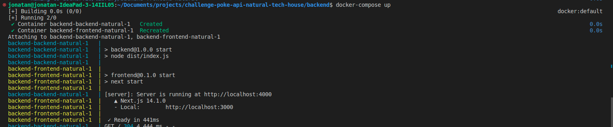
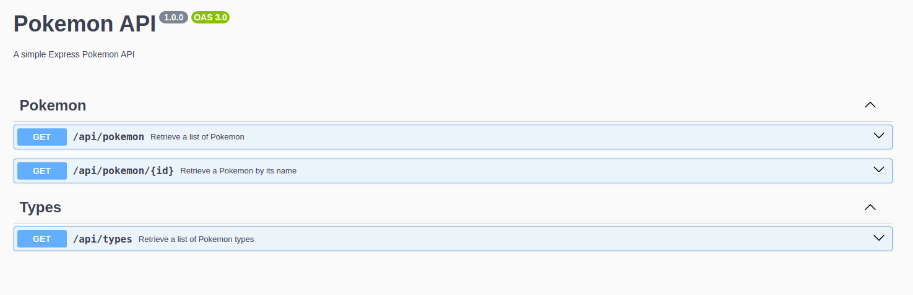

### Challenge Full Stack Natural - Backend

# Technologies

- Node.js
- Express
- Typescript
- Swagger
- Jest
- Axios
- EsLint
- Prettier
- Husky (pre-commit): for linting and conventional commits.

## Installation

```bash
git clone <repo>

npm install

npm run dev # for development

npm run test # for testing

```

Go to repo : [Frontend](https://github.com/jonatan-c/natural--frontend.git) and follow the instructions to run the frontend.


## Docker

```bash
docker-compose up 
```




## images swaggers - 
http://localhost:4000/api-docs/




## Clarifications:

- For simplicity i put the .env file in the repo, but in a real project it should be in the .gitignore file.
- The Frontend has port 3000 in repo, dockerfile and docker-compose for simplicity, but in a real project it should be in the .env file.
- The backend has port 4000 in repo, dockerfile and docker-compose for simplicity, but in a real project it should be in the .env file.